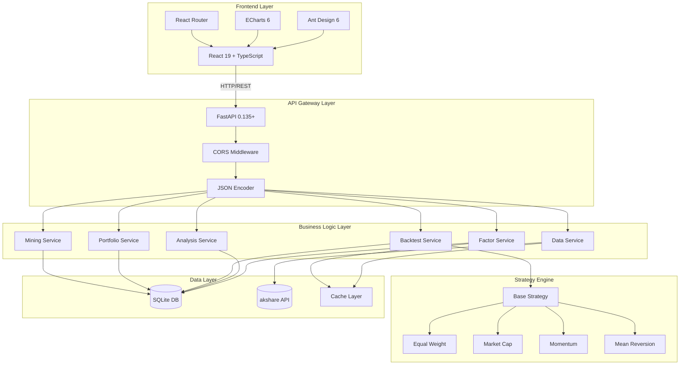
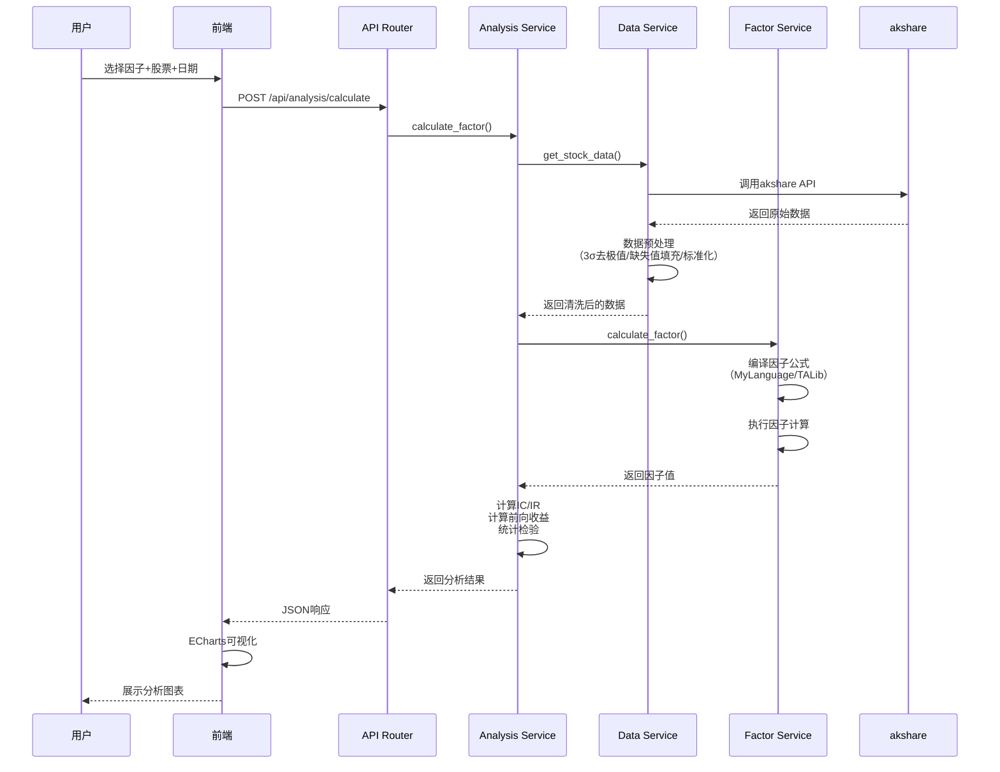
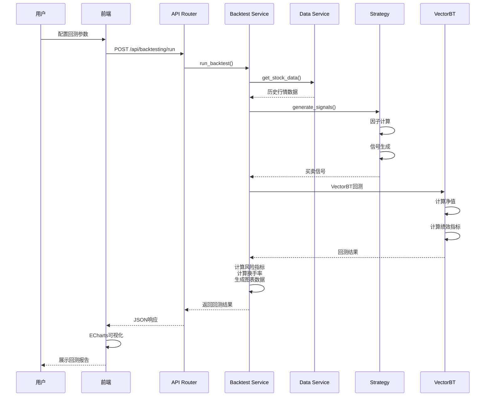

# FactorHub

**FactorHub** 是一个开源的现代化量化因子分析平台，专为中国A股市场设计。

> FactorHub = Factor（因子） + Hub（中心）

一个集因子管理、分析、挖掘、组合优化和策略回测于一体的全栈量化投研系统。

---

## 语言选项

- 🇬🇧 **English** - [README.md](README.md)
- 🇯🇵 **日本語 (Japanese)** - [README_JP.md](README_JP.md)

---

## 核心价值

| 价值支柱                   | 说明                                        |
| -------------------------- | ------------------------------------------- |
| 🎯**完整因子生命周期管理** | 从因子创建、验证、分析到部署的全流程支持    |
| 🧪**科学的因子评估体系**   | IC/IR分析、单调性检验、换手率分析等专业指标 |
| 🧬**智能因子挖掘**         | 基于遗传算法的自动因子挖掘，发现阿尔法信号  |
| 📊**专业回测引擎**         | 支持多因子组合、策略对比、性能归因分析      |

---

## 核心功能


### 1. 因子管理

- ✅ **自定义因子定义** - 支持通达信（麦语言）语法和TALib函数
- ✅ **公式验证** - 实时语法检查和逻辑验证
- ✅ **版本管理** - 因子修改历史记录和版本回滚
- ✅ **预置因子库** - 内置常用技术因子（MA、RSI、MACD、布林带等）


### 2. 因子分析

- ✅ **IC/IR分析** - 信息系数和信息比率计算（支持1日、5日、10日预测周期）
- ✅ **因子暴露度分析** - 分析股票在因子上的暴露分布
- ✅ **因子有效性检验** - 多维度评估因子预测能力
- ✅ **因子归因分析** - 分解因子对收益的贡献
- ✅ **动态监测** - 时间序列维度的因子表现跟踪


### 3. 因子挖掘

- ✅ **遗传算法挖掘** - 基于DEAP的进化算法自动搜索有效因子
- ✅ **多目标优化** - 同时优化IC、IR、单调性等多个目标
- ✅ **因子生成** - 支持基本算子、函数调用、时间窗口操作
- ✅ **并行计算** - 支持种群并行评估，加速挖掘过程


### 4. 组合分析

- ✅ **多因子组合** - 支持等权、市值加权、最大化IC_IR等组合方法
- ✅ **风险模型** - 因子中性化处理
- ✅ **优化配置** - 基于历史表现的因子权重优化
- ✅ **组合绩效** - 年化收益、夏普比率、最大回撤等指标


### 5. 策略回测

- ✅ **单因子回测** - 基于因子分位数的选股回测
- ✅ **多因子策略** - 复合因子信号生成
- ✅ **策略对比** - 多策略并行回测和对比分析
- ✅ **绩效指标** - 收益、风险、换手率等完整指标体系
- ✅ **可视化图表** - 净值曲线、回撤、因子表现等图表


---

## 技术架构

### 技术栈

**后端:**

- FastAPI 0.135+ - 高性能Web框架
- SQLAlchemy 2.0 - ORM数据库操作
- SQLite - 轻量级数据存储
- Pandas 2.0+ / NumPy - 数据处理
- TA-Lib - 技术分析库
- VectorBT 0.25+ - 回测引擎
- DEAP 1.3+ - 遗传算法框架
- XGBoost 2.0+ - 机器学习模型
- SHAP 0.42+ - 模型解释
- akshare 1.12+ - 中国A股数据源

**前端:**

- React 19 - 用户界面框架
- TypeScript - 类型安全
- Ant Design 6 - UI组件库
- ECharts 6 - 数据可视化
- React Router 7 - 路由管理
- Axios - HTTP客户端
- Vite - 构建工具

### 系统架构（三层设计）

```
┌─────────────────────────────────────────────────────────┐
│                     前端层 (Frontend)                    │
│  ┌──────────┐  ┌──────────┐  ┌──────────┐  ┌──────┐ │
│  │ 因子管理  │  │ 因子分析  │  │ 组合优化  │  │ 回测  │ │
│  └──────────┘  └──────────┘  └──────────┘  └──────┘ │
└─────────────────────────────────────────────────────────┘
                            ↓ HTTP / REST API
┌─────────────────────────────────────────────────────────┐
│                    API层 (Routers)                       │
│  /api/factors    /api/analysis    /api/mining           │
│  /api/portfolio  /api/backtest    /api/data             │
└─────────────────────────────────────────────────────────┘
                            ↓
┌─────────────────────────────────────────────────────────┐
│                  业务逻辑层 (Services)                    │
│  ┌─────────────────┐  ┌─────────────────┐              │
│  │  factor_service │  │  analysis_service│              │
│  └─────────────────┘  └─────────────────┘              │
│  ┌─────────────────┐  ┌─────────────────┐              │
│  │  backtest_svc   │  │  portfolio_svc  │              │
│  └─────────────────┘  └─────────────────┘              │
│  ┌─────────────────┐  ┌─────────────────┐              │
│  │  mining_svc     │  │  data_service   │              │
│  └─────────────────┘  └─────────────────┘              │
│  ┌───────────────────────────────────────────────────┐  │
│  │           策略系统 (Strategies)                     │  │
│  │  等权  市值加权  动量  均值回归  自定义...        │  │
│  └───────────────────────────────────────────────────┘  │
└─────────────────────────────────────────────────────────┘
                            ↓
┌─────────────────────────────────────────────────────────┐
│                  数据访问层 (Repositories)               │
│              factor_repository, etc.                      │
└─────────────────────────────────────────────────────────┘
                            ↓
┌─────────────────────────────────────────────────────────┐
│                    数据库层 (Database)                    │
│  ┌──────────┐  ┌──────────┐  ┌──────────┐            │
│  │ factors  │  │ backtests│  │  cache   │            │
│  └──────────┘  └──────────┘  └──────────┘            │
└─────────────────────────────────────────────────────────┘
                            ↓
┌─────────────────────────────────────────────────────────┐
│                   外部数据源 (Data Sources)               │
│  ┌───────────────────────────────────────────────────┐  │
│  │         akshare (A股数据)                          │  │
│  │  日线数据  财务数据  指数数据  行业分类...        │  │
│  └───────────────────────────────────────────────────┘  │
└─────────────────────────────────────────────────────────┘
```

---

## 项目结构

```
FactorHub/
├── backend/                    # 后端代码
│   ├── api/                   # API层
│   │   ├── main.py           # FastAPI主应用
│   │   └── routers/          # API路由
│   │       ├── factors.py    # 因子管理接口
│   │       ├── analysis.py   # 因子分析接口
│   │       ├── mining.py     # 因子挖掘接口
│   │       ├── portfolio.py  # 组合分析接口
│   │       ├── backtest.py   # 策略回测接口
│   │       └── data.py       # 数据管理接口
│   ├── services/              # 业务逻辑层
│   │   ├── factor_service.py          # 因子服务
│   │   ├── analysis_service.py        # 分析服务
│   │   ├── backtest_service.py        # 回测服务
│   │   ├── portfolio_analysis_service.py  # 组合服务
│   │   ├── genetic_factor_mining_service.py  # 挖掘服务
│   │   ├── data_service.py            # 数据服务
│   │   ├── factor_generator_service.py    # 因子生成
│   │   ├── factor_validation_service.py  # 因子验证
│   │   ├── factor_attribution_service.py # 归因分析
│   │   ├── factor_exposure_service.py    # 暴露度分析
│   │   ├── factor_effectiveness_service.py # 有效性分析
│   │   ├── factor_monitoring_service.py    # 动态监测
│   │   ├── formula_compiler_service.py   # 公式编译
│   │   ├── vectorbt_backtest_service.py  # VectorBT回测
│   │   └── ...
│   ├── strategies/            # 策略实现
│   │   ├── base_strategy.py  # 策略基类
│   │   └── strategy_registry.py  # 策略注册
│   ├── repositories/          # 数据访问层
│   │   └── factor_repository.py
│   ├── models/                # ORM模型
│   │   └── factor.py
│   └── core/                  # 核心配置
│       ├── settings.py        # 配置管理
│       └── database.py        # 数据库连接
├── frontend/                   # 前端代码
│   └── react-antd/            # React + Ant Design版本
│       ├── src/
│       │   ├── pages/         # 页面组件
│       │   │   ├── Home.tsx
│       │   │   ├── FactorManagement.tsx
│       │   │   ├── FactorAnalysis.tsx
│       │   │   ├── FactorMining.tsx
│       │   │   ├── PortfolioAnalysis.tsx
│       │   │   └── Backtesting.tsx
│       │   ├── components/    # 通用组件
│       │   │   └── BacktestCharts.tsx
│       │   ├── services/      # API客户端
│       │   │   └── api.ts
│       │   ├── utils/         # 工具函数
│       │   │   └── router.tsx
│       │   └── types/         # TypeScript类型
│       ├── package.json
│       ├── vite.config.ts
│       └── .npmrc
├── config/                     # 配置文件
│   └── factors.yaml           # 预置因子配置
├── data/                       # 数据目录
│   ├── db/                    # SQLite数据库
│   └── cache/                 # 数据缓存
├── docs/                       # 文档
├── tests/                      # 测试
├── scripts/                    # 工具脚本
├── pyproject.toml             # Python依赖配置
├── start_api.py               # 后端启动脚本
├── start_all.py               # 一键启动脚本
└── README.md
```

---

## 系统架构图



---

## 数据流架构

### 因子分析数据流



### 回测数据流



---

## 应用场景

### 1. 因子研究人员

**场景**：量化研究员需要测试一个新的技术因子

**操作流程**：

1. 在因子管理页面创建新因子，输入公式（如 `(CLOSE - REF(CLOSE, 5)) / REF(CLOSE, 5)`）
2. 系统自动验证公式语法和逻辑
3. 进入因子分析页面，选择该因子和沪深300成分股
4. 运行IC分析，查看因子预测能力
5. 使用遗传算法挖掘优化该因子

### 2. 基金经理

**场景**：构建多因子选股组合

**操作流程**：

1. 从因子库中选择5-8个有效因子（估值、动量、质量等）
2. 进入组合分析页面，配置因子权重
3. 系统进行因子中性化处理
4. 查看组合历史表现和风险指标
5. 使用优化器自动寻找最优权重配置

### 3. 量化交易员

**场景**：回测多因子选股策略

**操作流程**：

1. 选择2-3个互补因子构建复合信号
2. 进入策略回测页面，配置参数（初始资金、手续费、调仓频率）
3. 选择等权或市值加权策略
4. 运行回测，查看净值曲线、回撤、夏普比率
5. 对比多个策略的表现，选择最优方案

### 4. 金融工程团队

**场景**：批量挖掘和管理因子库

**操作流程**：

1. 使用遗传算法挖掘器，设置种群规模100，进化50代
2. 系统自动搜索有效因子组合
3. 对挖掘出的因子进行严格的样本外测试
4. 将有效因子加入生产因子库
5. 持续监控因子表现衰减

---

## 快速开始

### 前置要求

- **Python 3.11+**
- **Node.js 18+**
- **pnpm** (包管理器)
- **TA-Lib** (技术分析库)

### 下载安装 Node.js
访问[下载 Node.js®](https://nodejs.org/zh-cn/download/)选择合适版本（如v20.20.2）的nodejs下载并安装。


### 安装 pnpm
参考：https://pnpm.io/installation
- windows
```bash
# use powershell
Invoke-WebRequest https://get.pnpm.io/install.ps1 -UseBasicParsing | Invoke-Expression
```

- linux/max
```bash
npm install -g pnpm
```


### 安装 TA-Lib

**Windows:**

```bash
# 下载预编译的wheel包安装
# 下载地址：https://sourceforge.net/projects/talib-whl/files/ta_lib_0.4.28/
pip install TA_Lib-0.4.28-cp311-cp311-win_amd64.whl
```

**Mac:**

```bash
brew install ta-lib
pip install TA-Lib
```

**Linux:**

```bash
sudo apt-get install ta-lib
pip install TA-Lib
```

### 一键启动

使用提供的 `start_all.py` 脚本可以一键启动所有服务：

```bash
cd h:\pythonwork\FactorFlow
python start_all.py
```

这个脚本会：

1. 检查环境（pnpm、node_modules）
2. 自动安装前端依赖（如果需要）
3. 启动后端API服务（端口8000）
4. 启动前端开发服务器（端口5173）
5. 自动打开浏览器

### 分别启动

#### 后端

```bash
# 使用 uv（推荐）
uv sync
uv run python start_api.py

# 或使用标准 Python
pip install -r requirements.txt
python start_api.py
```

后端将在 http://localhost:8000 启动，API文档位于 http://localhost:8000/docs

#### 前端

```bash
cd frontend/react-antd
pnpm install
pnpm dev
```

前端将在 http://localhost:5173 启动

### 访问应用

启动成功后，访问：

| 服务     | 地址                       | 说明               |
| -------- | -------------------------- | ------------------ |
| 前端应用 | http://localhost:5173      | React + Ant Design |
| API服务  | http://localhost:8000      | FastAPI后端        |
| API文档  | http://localhost:8000/docs | Swagger文档        |

---

## 数据处理计算逻辑

### 1. 数据获取与缓存

**数据源**：akshare（开源A股数据接口）

**缓存策略**：

- 缓存目录：`data/cache/akshare/`
- 缓存时间：7天（可配置）
- 缓存键：基于股票代码和日期范围的哈希值

**数据字段**：

- 开盘价（OPEN）、最高价（HIGH）、最低价（LOW）、收盘价（CLOSE）
- 成交量（VOLUME）、成交额（AMOUNT）
- 涨跌幅（PCT_CHG）

### 2. 数据预处理流程

```
原始数据
    ↓
缺失值检测
    ↓
前向填充（Forward Fill）
    ↓
后向填充（Backward Fill）（兜底）
    ↓
异常值检测（3σ原则）
    ↓
异常值截断（Winsorize）
    ↓
滚动窗口标准化（252交易日）
    ↓
预处理完成数据
```

**详细说明**：

1. **缺失值处理**
   - 首先尝试前向填充（使用上一个有效值）
   - 剩余缺失值使用后向填充（使用下一个有效值）
   - 仍有缺失则删除该行（极端情况）

2. **异常值处理**
   - 计算滚动252日均值和标准差
   - 超过均值±3σ的值被视为异常值
   - 异常值被截断到±3σ边界

3. **标准化处理**
   - 使用滚动252日窗口进行z-score标准化
   - `normalized = (value - mean) / std`
   - 避免未来数据泄露

### 3. 因子计算引擎

**公式语法**：支持通达信（MyLanguage）语法

**内置函数**：

| 函数名                        | 说明             | 示例                        |
| ----------------------------- | ---------------- | --------------------------- |
| `REF(X, N)`                   | 引用N周期前的X值 | `REF(CLOSE, 1)`             |
| `SMA(X, N)`                   | 简单移动平均     | `SMA(CLOSE, 5)`             |
| `EMA(X, N)`                   | 指数移动平均     | `EMA(CLOSE, 10)`            |
| `HHV(X, N)`                   | N周期内最高价    | `HHV(HIGH, 20)`             |
| `LLV(X, N)`                   | N周期内最低价    | `LLV(LOW, 20)`              |
| `SUM(X, N)`                   | N周期求和        | `SUM(VOLUME, 5)`            |
| `AVE(X, N)`                   | N周期均值        | `AVE(CLOSE, 10)`            |
| `STD(X, N)`                   | N周期标准差      | `STD(CLOSE, 20)`            |
| `RSI(X, N)`                   | RSI指标          | `RSI(CLOSE, 14)`            |
| `MACD(X, fast, slow, signal)` | MACD指标         | `MACD(CLOSE, 12, 26, 9)`    |
| `BBANDS(X, N, K)`             | 布林带           | `BBANDS(CLOSE, 20, 2)`      |
| `ADX(X, N)`                   | ADX指标          | `ADX(HIGH, LOW, CLOSE, 14)` |
| `ATR(X, N)`                   | ATR指标          | `ATR(HIGH, LOW, CLOSE, 14)` |

**运算符**：`+`、`-`、`*`、`/`、`>`、`<`、`>=`、`<=`、`==`、`&`（与）、`|`（或）

**因子示例**：

```
# 动量因子（5日收益率）
(CLOSE - REF(CLOSE, 5)) / REF(CLOSE, 5)

# 均值回归因子
(AVE(CLOSE, 20) - CLOSE) / AVE(CLOSE, 20)

# 波动率因子
STD(CLOSE, 20) / AVE(CLOSE, 20)

# 量价配合因子
(CLOSE - REF(CLOSE, 1)) * VOLUME
```

### 4. IC/IR计算逻辑

**IC（Information Coefficient，信息系数）**：

- 定义：因子值与未来收益率的相关系数
- 作用：衡量因子的预测能力

**计算步骤**：

1. 对每只股票，计算t期的因子值 `factor_t`
2. 计算t+1期的收益率 `return_{t+1} = (close_{t+1} - close_t) / close_t`
3. 计算截面上所有股票的 `factor_t` 与 `return_{t+1}` 的Pearson相关系数 → 得到t期的IC
4. 对时间序列上所有IC值计算均值和标准差

**IC均值**：

```
IC_mean = mean(IC_1, IC_2, ..., IC_T)
```

**IR（Information Ratio，信息比率）**：

```
IR = IC_mean / IC_std
```

其中 `IC_std` 是IC的时间序列标准差。

**预测周期**：

- 支持1日、5日、10日预测周期
- 可配置：`forward_returns = [1, 5, 10]`

**统计检验**：

- IC的t统计量
- IC的p值
- IC>0的比例
- IC的自相关性

### 5. 回测引擎逻辑

**VectorBT集成**：

- 基于VectorBT 0.25+高性能回测框架
- 支持向量化计算，大幅提升回测速度

**单因子回测**：

1. 计算因子值
2. 按因子值排序，分为N组（默认5组）
3. 做多因子值最高的一组，做空最低的一组（可选）
4. 定期调仓（日频、周频、月频）

**绩效指标**：

- **收益率**：累计收益率、年化收益率
- **风险指标**：波动率、夏普比率、最大回撤、Calmar比率
- **交易指标**：换手率、交易次数、胜率、盈亏比

**净值计算**：

```
equity_t = equity_{t-1} * (1 + return_t)
```

**手续费模型**：

- 默认：万分之三（0.03%）
- 单边收费，买卖均收取

---

## 许可证

### 双重许可证

**个人使用**：

本项目采用 **GNU Affero General Public License v3.0 (AGPL-3.0)** 开源许可证。

您可以自由地：

- ✅ 使用本软件用于个人学习、研究和非商业用途
- ✅ 修改和改进本软件
- ✅ 分发修改后的版本（需保持相同许可证）
- ✅ 在您的项目中引用本项目

**商业使用**：

⚠️ **重要提示**：任何商业用途（包括但不限于：

- 在商业产品中集成本项目
- 使用本项目提供付费服务
- 使用本项目进行生产环境的量化交易
- 在公司内部使用本项目进行投研）

**都需要获得单独的商业授权**。

---

### 联系我们获取商业授权

**邮箱**：yl_zhangqiang@foxmail.com

请在邮件中说明：

1. 您的公司/组织名称
2. 您的使用场景和需求
3. 预计使用规模
4. 联系人信息

我们将在3个工作日内回复您。

---

## 联系我们

**项目维护者**：FactorHub Team

**邮箱**：yl_zhangqiang@foxmail.com

**欢迎反馈**：

- Bug报告
- 功能建议
- 技术交流
- 合作咨询

---

## 致谢

感谢以下开源项目：

- [akshare](https://github.com/akfamily/akshare) - 开源财经数据接口
- [FastAPI](https://fastapi.tiangolo.com/) - 现代Python Web框架
- [VectorBT](https://vectorbt.dev/) - 量化回测框架
- [Ant Design](https://ant.design/) - 企业级UI设计语言
- [ECharts](https://echarts.apache.org/) - 数据可视化库

---

**最后更新**：2026-03-14
